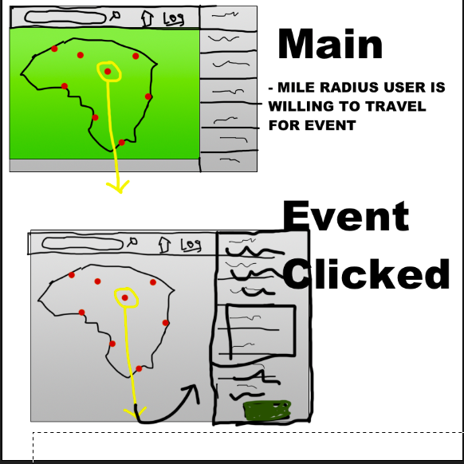
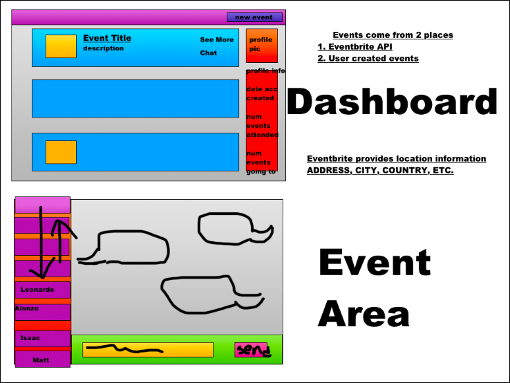

# Happening - Local Event Creator and Search

## Table of Contents

- [Summary](#Summary)
- [Wireframe](#Wireframe)
- [Code](#Code-Snippet)
- [User-Story](#User-Story)
- [Technologies](#Technologies)
- [Authors](#Authors)
- [Acknowledgements](#Acknowledgements)

## Summary

The purpose of this site is to create a forum that users can log into and see posts organized by city detailing any local hauntings or ghost sightings that they have experienced. Users can register accounts, search cities, create posts and embed images. Users can also commont on or vote on others' posts. Posts, locations, and users are stored server-side.

## Wireframe

## Code Snippet

## Steps

- Initial framework of pages
- Set up React App
- Set up API routes
- Set up models
- Set up components and pages
- Page functionality
- Design/styling of pages

## User Story

- I want to be able to see events in my local area
- I want to be able to create an account
- I want to be able to comment or chat with people interested in my area
- I want to be able to add events as a logged in user
- I want to be able to click links to buy tickets

## Technologies Used

- [React](https://reactjs.org/)
- [CSS](https://developer.mozilla.org/en-US/docs/Web/CSS)
- [Javascript](https://developer.mozilla.org/en-US/docs/Web/JavaScript)
- [Express](https://expressjs.com/)
- [Apollo Express](https://www.npmjs.com/package/apollo-server-express)
- [Compression](https://www.npmjs.com/package/compression)
- [GraphQL](https://graphql.org/)
- [Mongoose](https://www.npmjs.com/package/mongoose)
- [Morgan](https://www.npmjs.com/package/morgan)
- [React Map GL](https://visgl.github.io/react-map-gl/)
- [React Google Places](https://www.npmjs.com/package/react-google-places-autocomplete)
- [Material UI](https://mui.com/)
- [React Bootstrap](https://react-bootstrap.github.io/)
- [Node Geocoder](https://www.npmjs.com/package/node-geocoder)

## Contributors

- **Alonzo Roman**

* [Link to Github](https://github.com/alonzofroman)
* [Link to LinkedIn](https://www.linkedin.com/)

- **Isaac Hernandez**

- **Matt Stephens**

* [Link to Portfolio Site](https://mstephen19.github.io)
* [Link to Github](https://github.com/mstephen19)
* [Link to LinkedIn](https://www.linkedin.com/in/mstephen19/)

- **Leonardo Gutierrez**

## Acknowledgments

- [W3Schools](https://www.w3schools.com/)
- [MDN Web Docs](https://developer.mozilla.org/en-US/)